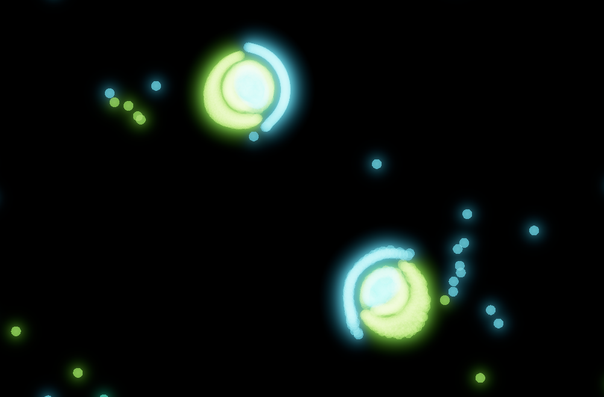
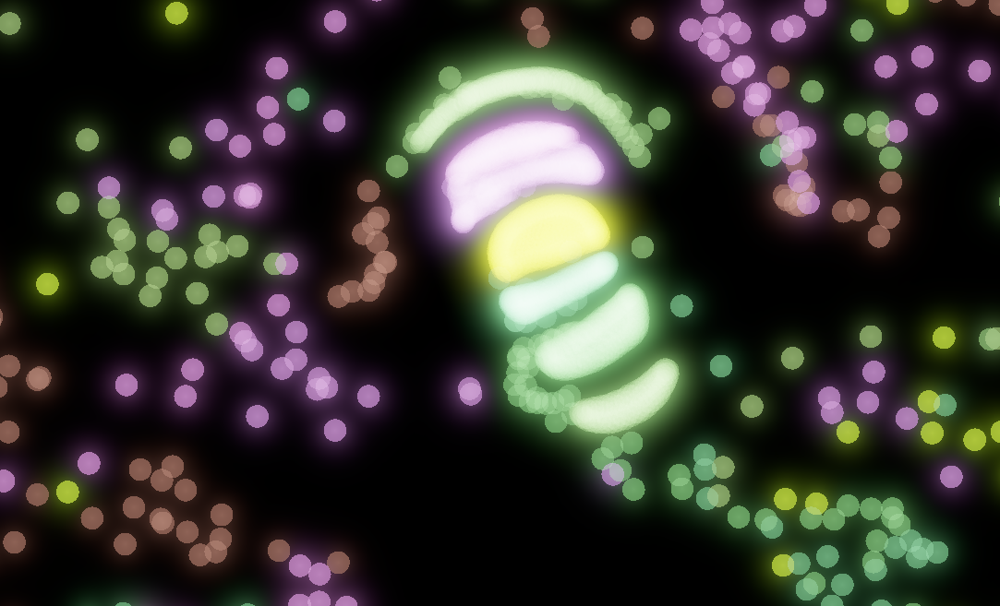

# Parrticle Life Simulation




All of the [shaders](shader.zig) including the computing shaders are written using `zig`'s new SPIRV backend.
## Build
```bash
> zig version
0.17.0-dev.1471+ff10b90bc
```
```bash
zig build -Drelease
```
I have only tested it on x86-64-windows, though it should work on any major platform.
### Dependencies
All dependency is vendored.

- RGFW
- vulkan
- stb_truetype
## References
[Particle Life simulation in browser using WebGPU](https://lisyarus.github.io/blog/posts/particle-life-simulation-in-browser-using-webgpu.html) (❤️)
